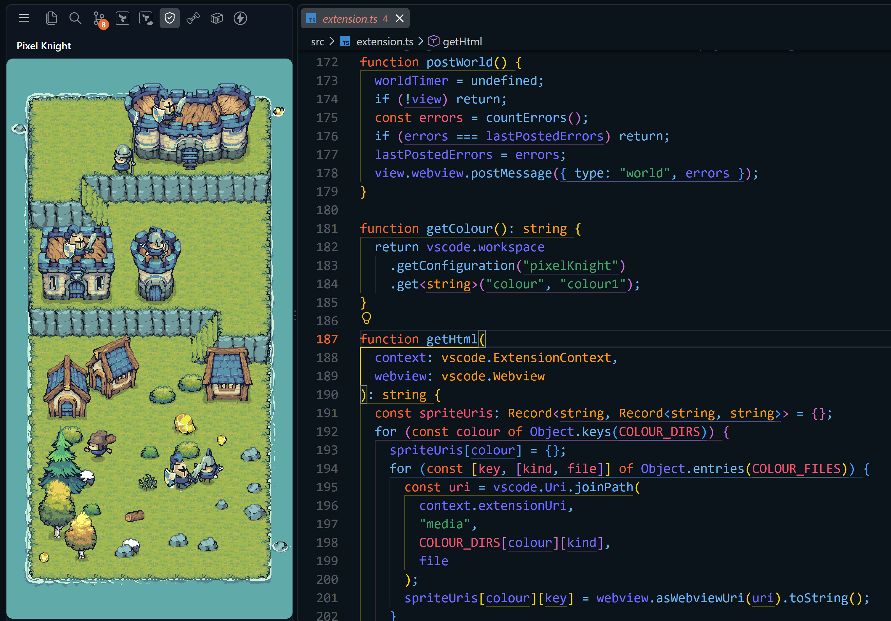
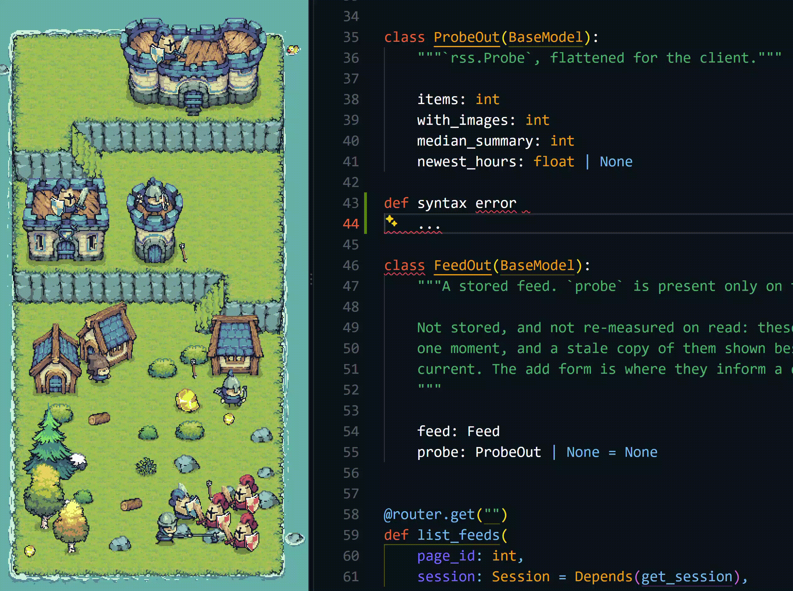

# Pixel Knights


A small pixel island in your sidebar, with a castle, a village, and the units
that hold them. It reads out your error diagnostics. Break the build and raiders
land on the shore. Fix the errors and the garrison cuts them down. The whole
thing is one canvas in a webview. No accounts, no tracking, and nothing leaves
your machine.



## Features

- An island of stacked **elevations**, drawn from the [Tiny Swords](https://pixelfrog-assets.itch.io/tiny-swords) tileset. A castle and a tower on the top elevation, barracks and a second tower below, and a village on the ground
- **A garrison that lives where it is posted.** Archers on the walls, Lancers at the castle gate, Warriors at the barracks. No unit in armour starts on the shore, because the ground belongs to the Pawn
- Grass stairs cut into each cliff, on opposite sides, so the elevations zigzag. **The units walk them.** Soldiers come down from the upper elevations, garrison figures leave their posts to walk the village, and the Pawn carries wood and gold up to the castle
- **Raids driven by your errors.** One red raider per error, up to three. Every Archer on the island opens fire at once, and a Warrior and a Lancer come down the stairs to meet them
- The layout is worked out from the size of the pane, so the scene rebuilds when you resize the sidebar instead of getting cut off
- Two colours, blue and black, changed live from settings. The units and every building change together
- A status bar entry opens the view, and `Pixel Knights: Focus Companion View` does the same from the command palette

## Install

Search **Pixel Knights** in the Extensions view, or:

```sh
code --install-extension nauqh.pixel-knights
```

## How the island reacts

The host publishes one thing to the renderer: the current count of **error**
diagnostics. Everything below is the renderer's reading of that number, so the
island responds to whatever produces your errors, whether that is a language
server, a linter or a compile task, and not to any particular editor event.

| Error count | What happens |
|---|---|
| Rises above zero | One red raider per error wades in from the right shore, up to three, and they line up on the beach. Every Archer on the island opens fire from where it already stands, so the island answers before anything has moved |
| Stays above zero | The garrison turns out. The knight, which is one of the barracks Warriors, comes down and repeats two attacks and a guard. One Lancer leaves the castle's group of three and runs down the stairs to attack from the second row. Both take a few seconds, because they start where they are posted. Everything else holds its post, and the Pawn and the Sheep get out of the way |
| Falls | The raider nearest the fight dies in a puff of dust |
| Reaches zero | The raid ends and both units walk back up the stairs to their own elevation |

Diagnostics are debounced by 300ms, and an unchanged count is dropped rather
than posted, so a busy language server does not wake the render loop.

## The garrison

Every soldier is posted at a building. It stands either on the deck on top of
that building or on the ground in front of it. Archers go on top, because an
Archer is only worth having where it can see. The rest stand at the gate.

| Building | Where | Who |
|---|---|---|
| Castle | Deck | 1 Archer |
| Castle | Ground | 2 Lancers. One of them is the one that goes out to fight |
| Tower | Deck | 1 Archer. There is one tower per elevation |
| Barracks | Ground | 2 Warriors. One of them is the knight |

The guard is deliberately small. A castle elevation is about 190px of ledge at a
normal sidebar and the castle itself covers 156 of it, so a bigger guard fills
the whole ledge and reads as a queue rather than as a garrison.

Each elevation has its stair at one end, and the two tiles of ground beside that
stair sit one row lower than the rest. The tower stands there, on that lower
step. The stairs alternate sides, so the top tower is always on the left and the
one below it is always on the right. It also means the tower never competes with
the castle for space, so both towers appear at every pane size.

The castle and the barracks do need room, so what else you get depends on the
pane.

| Sidebar | What the island posts |
|---|---|
| About 300px wide and 620px tall or more | Everything. 3 Archers, 2 Lancers, 2 Warriors |
| About 300px wide, shorter pane | Only one elevation, so no barracks. 2 Archers, 2 Lancers, and the knight |
| Under about 300px wide | Too narrow for the castle, so a second tower stands in its place. With no castle there are no Lancers, so you get 2 Archers and the knight |

## Greenery on the upper levels

Bushes, rocks and the two short trees are scattered on the elevations as well as
on the ground, following what Pixel Frog does in the pack's own promo art, where
scrub grows along the lip of every cliff.

Two rules decide where it goes, and both come from the size of the ledge:

1. It sits on the lip, not spread over the whole elevation. An elevation is
   three tiles of grass and its building stands taller than all three, so
   anything placed behind a building is not partly hidden, it is completely
   hidden.
2. If there is no room beside the building, it grows at the foot of the wall
   instead, at the building's outer corners, drawn over the base stonework.
   Never across the gate, and never where a guard is standing.

That second rule is what makes it work at sidebar width. The castle elevation is
160px of ledge at a 300px pane and the castle covers 156 of it, so there is
nothing to plant beside. The gap does not reach the 56px a bush needs until the
sidebar is about 420px wide.

Only Tree3 and Tree4 are used up here. Tree1 and Tree2 stand 120px, taller than
the elevation they would be standing on. The trees are scenery and are never
cut, which also keeps them from turning into a stump that is taller than the
tree was.

## When nothing is wrong

Which is most of the time, so the island is built to be worth leaving open. Every
elevation can be walked on, and the stairs are the only way between them.

| Who | What they get up to |
|---|---|
| The knight | Walks up and down the barracks elevation it is posted on. Every few minutes it takes a longer walk, down into the village or up to the castle, then comes back |
| The Pawn | Carries an axe, pickaxe or knife out to a tree, a gold rock or the meat stand. It works the resource, picks up the load, and takes it to a house or all the way up to the castle, then walks home |
| Wood and gold | A cut tree is left as a stump for a minute or two and then grows back. A gold rock glows while it is being worked. The last standing tree is never cut |
| The garrison | A Lancer or a Warrior leaves its post now and then and walks the island. Only one at a time, so an elevation is never left empty. The Archers never leave at all, because they are the wall |
| Going indoors | Buildings are solid, so a unit on a deck has to use the door. It steps inside at the foot of the building, comes out on top, and does the reverse on the way back. A unit posted on the ground just walks |
| Everyone | Steps inside a building for a while and comes back out |
| The Sheep | Grass |

None of it runs to a fixed script. Each unit picks its own jobs, and the long
ones have a wait between them, so the island is quiet more often than it is busy.
The moment a raid lands it all stops. Anything above the ground walks back down
the stairs, anything indoors comes out, and the line forms.

Nothing is remembered between sessions yet. See [plan.md](docs/plan.md).

## The island

Tiny Swords is drawn at 1x on a 64px world grid, which is far too big for a
sidebar, so the scene is not simply scaled down with CSS. Two rules keep the
pixels straight:

1. **Resize the art once, and only once.** Each sheet is drawn one time into an
   offscreen canvas at half size, with smoothing off. Every draw after that
   reads from that cache at 1:1. When the pane is wide enough to be worth it,
   the whole viewport is scaled up by an **integer** factor, never a fraction.
2. **Integer positions.** No sprite ever lands on half a pixel, so nothing
   shimmers as it moves.

Units are not resized to a common body height. Each one stands on the ground
contact point drawn into its own shadow, which is why the Lancer, whose frame is
mostly spear, comes out the right size next to the Warrior. Draw order sorts on
that same contact point, so whoever is further down the screen is drawn last.

The terrain is built from the pack's tilemap rather than from pre-cut images. It
uses a nine slice for the water edge, another for each elevation, and a stone
wall row that stands on grass. The stairs are the pack's diagonal grass ramp, two
tiles tall, and each elevation's edge drops a row where the ramp meets it.
Without that drop the ramp looks like a mound instead of a way down.

## Configuration

| Setting | Default | Does |
|---|---|---|
| `pixelKnight.colour` | `colour1` | Unit and building colour. `colour1` is blue, `colour2` is black. It applies to every unit and building at once. Raiders stay red either way |

Colour changes are sent to the open view straight away, with no reload.

## Development

```sh
npm install
npm run build
```

Then press **F5**. That launches an Extension Development Host with Pixel Knights
loaded. Open it from the activity bar or from the status bar. `npm run package`
builds a `.vsix` you can install locally with `code --install-extension`.

If you also have the Marketplace build installed, both use the same icon in the
activity bar. The launch config passes
`--disable-extension=nauqh.pixel-knights` so that only the workspace copy loads.
It does not pass `--disable-extensions`, which would switch off the language
servers too, and with no diagnostics there is nothing to raid you. The copy that
does load says which one it is. The view header reads **Pixel Knights [DEV]**
with the version next to it, and the status bar entry reads `Warrior [dev]`.

```
src/extension.ts     startup, diagnostics hook, webview host
src/sprites.ts       the asset list: every sheet, and where it lives
media/companion.js   the whole renderer: layout, tilemap, animation, sprites
media/tiny-swords/   the copy of the asset pack
docs/plan.md         where this is going
```

`npm run watch` rebuilds `src/` on save. The renderer is plain browser
JavaScript with no build step of its own, so editing `media/companion.js` only
needs a reload of the Extension Development Host.

One thing has to match across the two sides. The sprite keys in `COLOUR_FILES`
and `SCENE_FILES` in `src/sprites.ts` build the list of URIs, and they must match
the keys the renderer looks up in the `SPR` and `NATIVE` tables in
`media/companion.js`. Adding a sprite means editing both files. One says where
the art is, the other says how big it is and where it stands on the ground.

If the sprite comes from a part of the pack that is currently excluded, you also
have to relax `.vscodeignore`, which keeps the unused teams out of the `.vsix`.

## Credits

All artwork is from the
**[Tiny Swords](https://pixelfrog-assets.itch.io/tiny-swords)** pack by
**[Pixel Frog](https://pixelfrog-assets.itch.io/)**, used under its license
terms. The code is MIT, the artwork is not. See [LICENSE](LICENSE) and
[THIRD_PARTY_NOTICES.md](docs/THIRD_PARTY_NOTICES.md). Purchase
[the pack](https://pixelfrog-assets.itch.io/tiny-swords) from Pixel Frog.
